Neato XV Robot Setup Utilities
==============================

The tool sets includes the followings

    nxvcontrol -- control Neato XV robot from GUI, supports functions include motor control, show sensors, LiDAR show and wheel moving etc.
    nxvforward -- forward the control over network
    nxvlogbatt -- log the battery status

# Usage

## nxvcontrol

### Connection

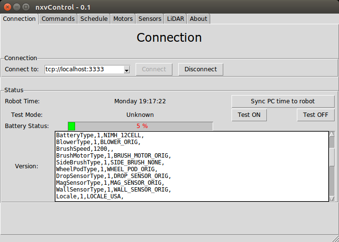
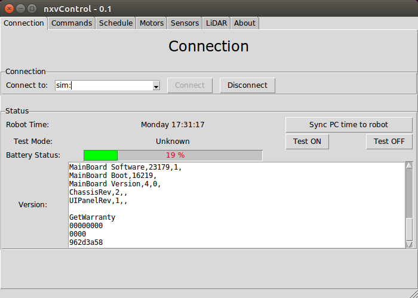

Before you control the Neato XV robot, you need to setup your robot so that
`nxvcontrol` can connect to your robot by clicking the *Connect* button in the *Connection* tab of the main program.

There're three types of connection for Neato XV devices, which are directly serial port, network connection, and simulation.
* directly serial port: you may specify the device name, for example, `dev://COM11:115200` is for the port `COM11` and the baudrate is 115200 in Windows.
* network connection: you may use a TCP port forwarder for your device and connect remotely from you PC.

  If you use a Linux box connected to your robot via USB, you may choose `socat` as port forwarder, such as:

      sudo socat TCP-LISTEN:3333,fork,reuseaddr FILE:/dev/ttyACM0,b115200,raw

  or use the `nxvforward` program provided by this package.

  The address *Connect to* line has its format such as `tcp://192.168.1.2:3333`, it'll connect to the port 3333 of the host `192.168.1.2`.

* simulator: this feature is for software development or testing. just use the "sim:" as the address line, and click "Connect" to start simulation.

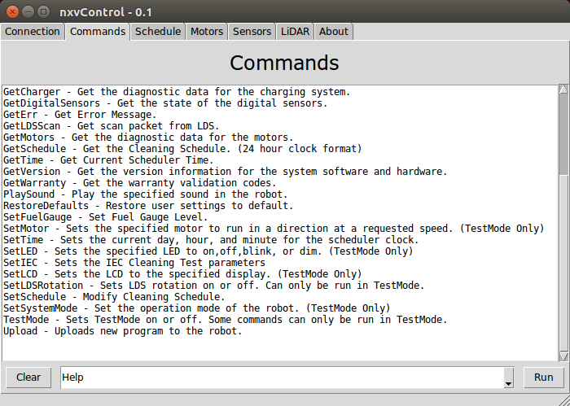
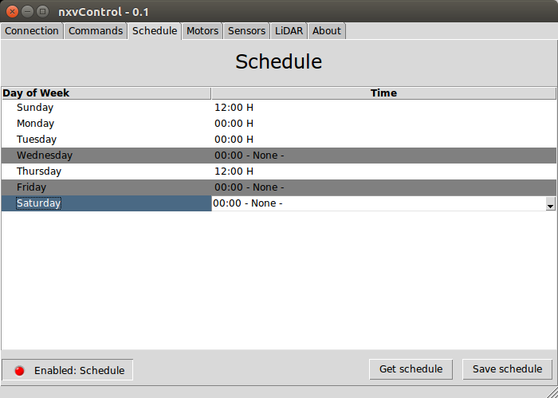
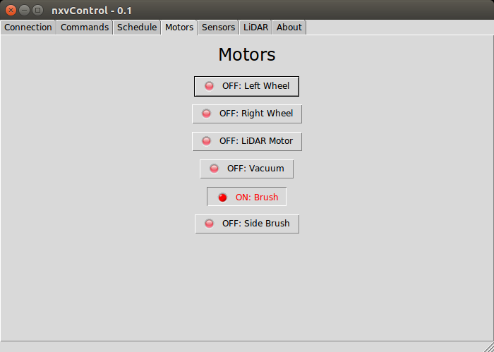
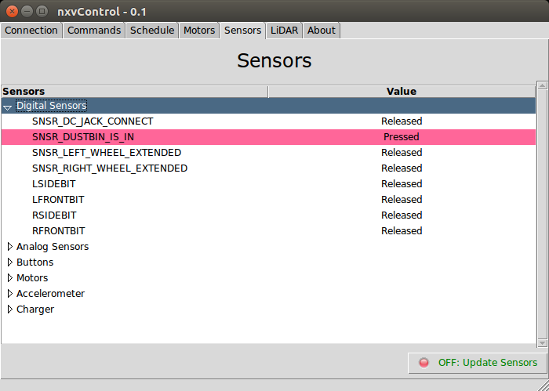
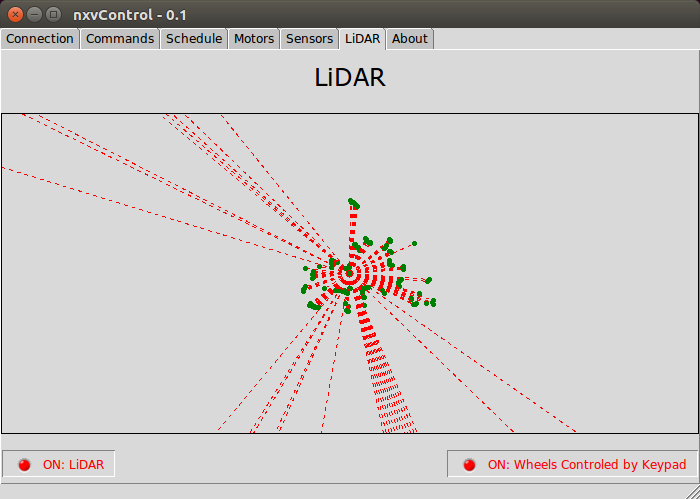

## nxvforward

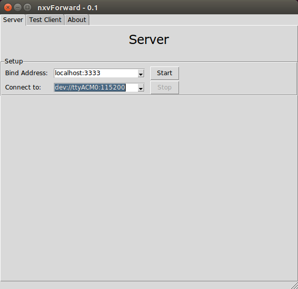
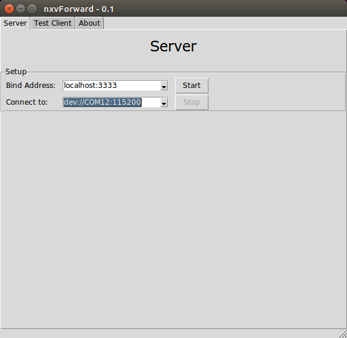
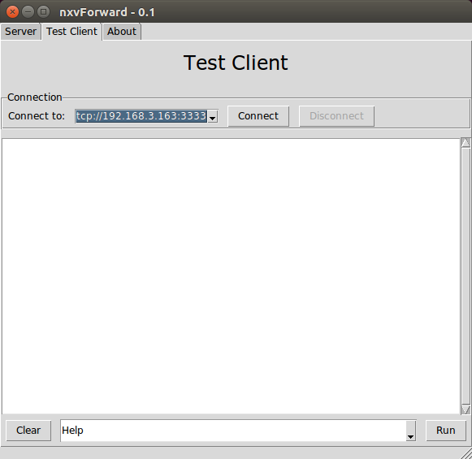

This is a TCP server, which can forward commands and data between device/simulator and clients.
The bind address can be `120.0.0.1:3333` to accept connection from local only, or `0.0.0.0:3333` for connections from other hosts.
The address line of *Connect to* is the same as `nxvcontrol` described above.

## nxvlogbatt

To log the Neato XV robot's battery status, you need to specify the port and the data file. For example:

    # for Linux
    python3 nxvlogbatt.py -l nxvlogbatt.log -o nxvlogbatt-data.txt -a dev://ttyACM0:115200

    # for Windows
    python3 nxvlogbatt.py -l nxvlogbatt.log -o nxvlogbatt-data.txt -a dev://COM12:115200

To plot the figures from the data file, you may want to use the script `nxvlogbatt-plotfig.sh`:

    nxvlogbatt-plotfig.sh PREFIX VBATRAT XRANGE TITLE COMMENTS

The arguments are

* PREFIX  -- the data text file prefix, for example, `prefix.txt`
* VBATRAT -- draw the line "VBattV*200/%"
* XRANGE  -- set the range of X(time), `[0:2000]`
* TITLE   -- the figure title
* COMMENTS -- the comments of the figure

Example:

    nxvlogbatt-plotfig.sh nxvlogbatt-data 0 "" "Battery Status" ""

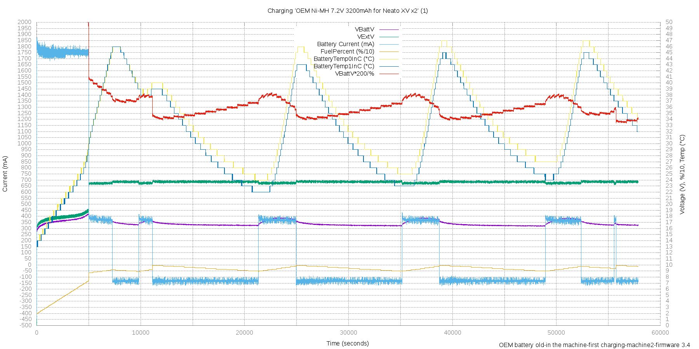

Implementation Details
----------------------

1. Neato XV Abstract Serial Interface

        Serial Port: COM11, /dev/ttyACM0
        Network Forward: tcp://localhost:3333
        Simulator: sim:

  The toolset interprets with above interfaces via unified APIs.
  The implementation is in file `neatocmdapi.py`, and the simulator functions is in file `neatocmdsim.py`.
  The simulator can simulate the return data described in the [Neato Programmer's Manual](https://www.neatorobotics.com/resources/programmersmanual_20140305.pdf).
  It also simulates that the returned LiDAR data would be all zero if the motor is not running.

2. Scheduler: It's in file `neatocmdapi.py`, in which all of the tasks are scheduled by a center scheduler in one program, so the execution of the commands would not interference with each other,
  even in a network forward mode which supports serving multiple clients. (The commands which are mutual exclusion may still have interferences).
  The class provides a callback function, so the user can specify the working function to execute once one task is ready to go.

3. NCIService

  It basically is a "hub" for the Neato serial interface, integrated a Scheduler and abstract serial interface,
  to support that the serial interface can only execute one task one time.
  The class provides `open()/close()` to start/stop the service;
  provides a `mailbox`(`class MailPipe`) and function `get_request_block()` to allow 
  user implement their own processing task functions.

4. GUI

  The toolset use Python `tkinter` to implement the GUI for the maximum portabilities between Linux, Windows, and other platforms.
  The tkinter GUI application uses the callback function to handle widget events, and to use the `widget.after(time, callback)` functions to preodically update the interfaces.
  To make the GUI convinient, the `guilog.py` provides several extensions for the widget, such as
    * Log output to textarea
    * ToggleButton
    * add right click pop-up menu to copy/paste text

5. Multi-Thread GUI

  To make the GUI more responsible for the user interactive, the toolset uses multiple threads to process requests in the background.
  Since only GUI thread can update the `tkinter` interface, the other threads have to use `Queue` to ask the GUI thread to update the interfaces.
  In this implementation, the `mailbox`(`class MailPipe`, in file `neatocmdapi.py`) is used as a center solution for updating various widgets to simplified the code.

